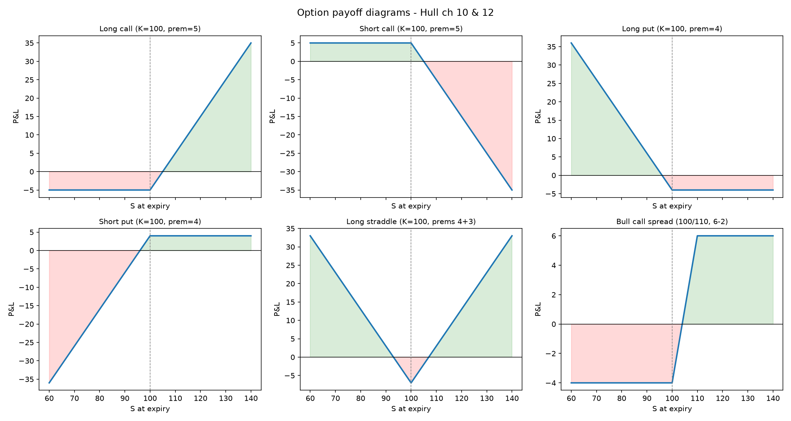

# Option payoffs and strategy diagrams

Payoff and profit functions for the basic option positions and two classic strategies,
written from the definitions with NumPy and matplotlib.



## The model

The payoff is what the position is worth at expiry, and the profit is that payoff
minus the premium paid at the start. Because the premium is a fixed cost that does
not depend on where the underlying finishes, subtracting it moves every point of the
line down by the same amount and leaves every slope unchanged. The contract sets the
shape, the premium only sets the height, which is why a long call breaks even at the
strike plus the premium rather than at the strike itself.

A long call pays `max(S - K, 0)` because it is a right and not an obligation: if the
underlying finishes below the strike you walk away, so the payoff is floored at zero
and the most you can lose is the premium. A forward pays `S - K` with no floor because
it obligates you to transact, so a fall below the strike is a real loss that grows one
for one with the underlying and stops only when the underlying reaches zero. That floor
is exactly what the premium buys, and it is the difference between carrying a known,
capped loss and carrying the full downside of the asset.

A long straddle is a long call plus a long put at the same strike, so the payoff
collapses to `|S - K|` and depends on the size of the move rather than its direction.
That makes it a bet on volatility: the premium you pay reflects the volatility the
market is currently pricing in, and you only profit if the move actually delivered is
larger than that. The break-evens sit at the strike plus or minus the total premium,
and the worst outcome is the underlying finishing exactly at the strike, where both
legs expire worthless and you lose the whole premium.

A bull call spread is long a call at a lower strike and short a call at a higher one.
The short call brings in premium, which is what makes the position cheaper than the
call on its own, but above the upper strike its losses cancel the long call's gains one
for one, so the payoff flattens. The loss is capped at the net premium and the gain is
capped at the distance between the strikes minus that premium. What you sold to reduce
the cost is every dollar of upside above the higher strike.

## What is implemented

| Function | What it returns |
|---|---|
| `call_payoff(S, K)` | Payoff at expiry of a long call, `max(S - K, 0)` |
| `put_payoff(S, K)` | Payoff at expiry of a long put, `max(K - S, 0)` |
| `forward_payoff(S, K)` | `S - K`, not floored at zero, because a forward obligates |
| `long_pnl(payoff, premium)` | Profit to the buyer, payoff less the premium paid |
| `short_pnl(payoff, premium)` | Profit to the seller, the exact mirror |
| `straddle_pnl(S, K, c, p)` | Long call plus long put at the same strike |
| `bull_call_spread_pnl(...)` | Long the low strike, short the high strike |

Every function is written against a NumPy array of spot prices, so the same code that
prices one point draws the whole diagram.

## Validation

Six tests, all of which check a property the payoff has to satisfy rather than a stored
number.

| Test | What it pins down |
|---|---|
| `test_call_payoff_itm_atm_otm` | The kink is at the strike, and the payoff is zero below it |
| `test_put_payoff_mirror_of_call` | Put and call payoffs are reflections about the strike |
| `test_long_and_short_are_zero_sum` | Buyer profit plus seller profit is exactly zero at every spot |
| `test_long_call_breakeven` | Profit crosses zero at strike plus premium, not at the strike |
| `test_straddle_worst_case_is_at_the_strike` | The straddle loses most when nothing happens |
| `test_bull_call_spread_caps_both_ways` | Both the maximum gain and the maximum loss are bounded |

The zero sum test is the one worth pointing at. It holds for every spot price on the
grid, which means the long and short sides cannot drift apart through a sign error.

## Usage

```bash
pip install -r ../requirements.txt
python -m pytest
python plot_strategies.py     # writes payoff_diagrams.png
```

## What I would do next

- Add the remaining spreads from Hull chapter 12: bear spreads, butterflies, calendars.
- Overlay the payoff at expiry with the value of the position before expiry, which is
  where the option premium and time value actually show up.
- Take real option chain prices for a single underlying and draw the strategy diagrams
  from live premiums instead of made up ones.

Built alongside Hull, *Options, Futures and Other Derivatives*, 11th edition,
chapters 10 and 12.
