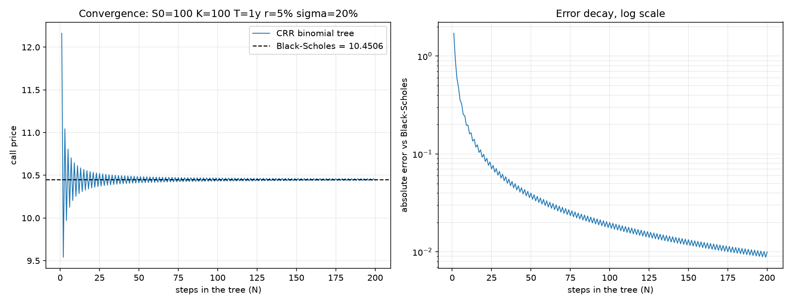

# quant-projects

Derivatives pricing written from the definitions in Python. Each folder is a self
contained project.



A Cox Ross Rubinstein tree walking into the Black-Scholes value as the step count grows.
Two derivations that share no code arriving at the same number is the point of the repo.

## Projects

| Folder | What it does | State |
|---|---|---|
| [`01_option_payoffs`](01_option_payoffs/) | Payoff and profit functions for calls, puts, straddles, strangles and spreads, with the strategy diagrams | Tests passing |
| [`02_binomial_tree`](02_binomial_tree/) | Cox Ross Rubinstein tree for European and American options, with a convergence check against Black-Scholes | Tests passing |

## Running it

```bash
git clone https://github.com/geohadd14/quant-projects.git
cd quant-projects
pip install -r requirements.txt
python -m pytest
```

Nothing here reaches the network or needs a data feed.

## How these are built

The point of the repo is the reasoning, not the line count.

- **Written from the formula, not from a library.** There is no `QuantLib` import here.
  The payoff functions, the risk neutral probability and the tree recursion are all
  written out so the code can be read next to the derivation.
- **Every pricer is checked against something independent.** A test that asserts today's
  output is a regression test, not a correctness test. The checks that count are the
  ones the model has to satisfy no matter what: put call parity, a tree converging to
  the closed form value as the step count grows, an American put worth more than a
  European one.
- **The README of each project explains the model.**

## Reading behind it

Hull, *Options, Futures and Other Derivatives*, 11th edition, is the spine. Project 01
sits on chapters 10 to 12, project 02 on chapter 13. Bennett, *Trading Volatility*,
alongside for desk intuition.
